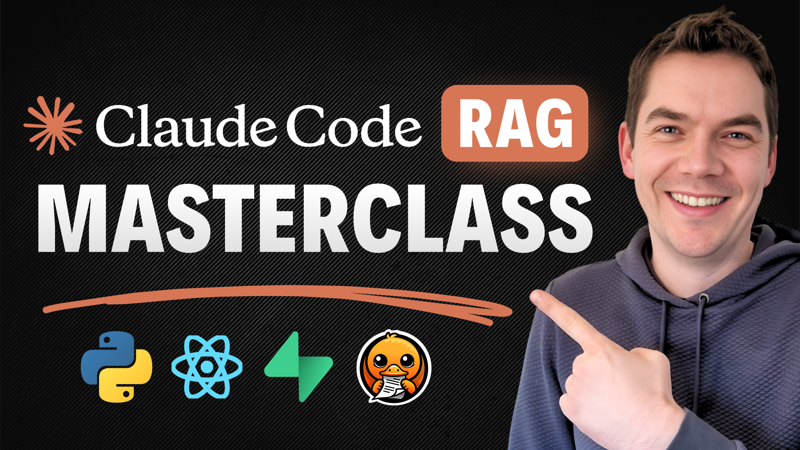

  

# Claude Code Agentic RAG Series

A reference implementation and learning foundation for building **agentic RAG systems with AI coding tools**.

This project was built collaboratively with Claude Code across multiple video episodes, where each episode adds new capabilities. This public repository contains the **PRDs, prompts, and planning documents** used to build each episode.

  

## The Episodes

| Episode | Title | What It Adds |
|---------|-------|--------------|
| [Episode 1](./ep1-agentic-rag-masterclass/) | **Agentic RAG Masterclass** | Full RAG foundation: chat UI, document ingestion, hybrid search, tool calling, sub-agents |
| [Episode 2](./ep2-knowledgebase-video/) | **Knowledge Base Explorer** | Filesystem-like tools for hierarchical knowledge navigation |
| [Episode 3](./ep3-redaction-anonymization-video/) | **PII Redaction & Anonymization** | Privacy layer ensuring sensitive data never reaches cloud LLMs |
| [Episode 4](./ep4-skills-sandbox-video/) | **Agent Skills & Code Sandbox** | Reusable skills system + Python execution in Docker containers |
| [Episode 5](./ep5-advanced-tool-use/) | **Advanced Tool Calling** | Dynamic tool registry, sandbox bridge, MCP integration |

## The App

The Agentic RAG App is a full-stack AI application built on **Python, React, and Supabase**.

It includes user authentication, a chat interface, document ingestion, and a complete RAG pipeline with hybrid search and reranking. The chat supports agentic features like text-to-SQL, web search, sub-agents, and a knowledge base explorer with filesystem-like tools.

Advanced features include an Agent Skills system, a code sandbox for executing Python in isolated Docker containers, and PII redaction for removing sensitive data.

## Choose Your Path

### Path 1: Build from Scratch
The deepest learning experience. You're not starting with any scaffold—you're building the entire system yourself.

**Get started:** Watch the [YouTube episodes](https://www.youtube.com/watch?v=4Tp6nPZa5is&list=PLmc6yUBIbca9ALRkJtz2Z4zLjkYXy1Y1n&pp=sAgC), use the PRDs in this repo, and build everything with Claude Code. You have everything you need right here.

### Path 2: Fork and Extend
Start from our codebase and build on top. Merge upstream changes occasionally, or use the PRDs from this repo to add future features independently.

**Get started:** Head to [theaiautomators.com](https://www.theaiautomators.com/), sign up, and you'll find repo access details inside.

### Path 3: Use the App
Clone the repo, spin it up, and use it as-is. Make minor changes (branding, config) and stay in sync with upstream releases.

**Get started:** Head to [theaiautomators.com](https://www.theaiautomators.com/), sign up, and you'll find repo access details inside.

## Tech Stack

| Layer | Tech |
|-------|------|
| Frontend | React, TypeScript, Tailwind, shadcn/ui, Vite |
| Backend | Python, FastAPI |
| Database | Supabase (Postgres + pgvector + Auth + Storage) |
| Doc Processing | Docling |
| AI Models | Local (LM Studio/Ollama) or Cloud (OpenAI, OpenRouter) |
| Code Execution | Docker + llm-sandbox |
| Observability | LangSmith / Langfuse |

## Deployment

- **Local**: Docker + self-hosted Supabase + local LLMs (Ollama/LM Studio)
- **Cloud**: Vercel (or any hosting) + Supabase Cloud + OpenAI/OpenRouter

## Resources

- [YouTube Masterclass](https://www.youtube.com/watch?v=xgPWCuqLoek&t=470s&pp=0gcJCa4KAYcqIYzv) — Original video series
- [The AI Automators](https://www.theaiautomators.com/) — Community access

## Community

Join [**The AI Automators**](https://www.theaiautomators.com/) to connect with hundreds of builders creating production-grade AI and RAG systems. Get help when you're stuck, share your progress, and see what others are building.